# Student Academic Tracker — Full ER Diagram (Detailed)

**Version:** 2.0  
**Last Updated:** 2026-01-19  
This file contains the full ER diagram (text + Mermaid) for the revised database design. It models Users, Students, Lecturers, Admins, Courses and Course Offerings, Enrollment, Content (Assignments, Quizzes, Lecture Notes), Submissions, Attendance, Grading, Files, Notifications, Events, and supporting tables.

Notes:
- PK = Primary Key, FK = Foreign Key
- All major tables include audit columns (created_at, updated_at, deleted, deleted_at) — omitted in diagram items for brevity.
- Lecturers are modeled as lecturer_profile linked to the central user table.
- Course offerings (course_offering) capture term-specific instances of a course and are the target for enrollment/content/attendance/grades.

-------------------------
1) ASCII-style ER Diagram (complete, expanded)

Entities and key columns (PK, FK). Relationship arrows show direction (→) and cardinality notes.

USER
- id (PK)
- email (UNIQUE)
- password_hash
- role (ENUM: STUDENT,LECTURER,ADMIN)
- is_active

STUDENT_PROFILE
- user_id (PK, FK → user.id)
- reg_number (UNIQUE)
- full_name
- gpa

LECTURER_PROFILE
- user_id (PK, FK → user.id)
- staff_number (UNIQUE)
- full_name
- department_id (FK → department.id)

ADMIN_PROFILE
- user_id (PK, FK → user.id)
- full_name

DEPARTMENT
- id (PK)
- code (UNIQUE)
- name

COURSE
- id (PK)
- course_code (UNIQUE)
- title
- department_id (FK → department.id)

COURSE_OFFERING
- id (PK)
- course_id (FK → course.id)
- term (e.g., 2026S1)
- lecturer_id (FK → lecturer_profile.user_id)   -- primary lecturer
- UNIQUE(course_id, term)

ENROLLMENT
- id (PK)
- student_id (FK → student_profile.user_id)
- offering_id (FK → course_offering.id)
- status (ENROLLED/DROPPED/COMPLETED)
- UNIQUE(student_id, offering_id)

FILE_STORE
- id (PK)
- storage_provider
- url
- filename
- content_type
- size_bytes
- checksum
- uploaded_by (FK → user.id)

ASSIGNMENT
- id (PK)
- offering_id (FK → course_offering.id)
- title
- due_date
- created_by (FK → user.id)

SUBMISSION
- id (PK)
- assignment_id (FK → assignment.id)
- student_id (FK → student_profile.user_id)
- file_id (FK → file_store.id)
- submitted_at
- grade
- UNIQUE(assignment_id, student_id)

QUIZ
- id (PK)
- offering_id (FK → course_offering.id)
- title
- start_time
- end_time

QUIZ_ATTEMPT
- id (PK)
- quiz_id (FK → quiz.id)
- student_id (FK → student_profile.user_id)
- started_at
- submitted_at
- score
- attempt_data (JSON)

EXAMSHEET
- id (PK)
- offering_id (FK → course_offering.id)
- title
- file_id (FK → file_store.id)
- exam_date

EXAM_RESULT
- id (PK)
- student_id (FK → student_profile.user_id)
- offering_id (FK → course_offering.id)
- exam_score
- grade_letter

COURSE_WEIGHT
- course_id (PK, FK → course.id)
- exam_percentage
- assignment_percentage
- quiz_percentage
- (application or CHECK constraint: sum = 100)

ATTENDANCE
- id (PK)
- student_id (FK → student_profile.user_id)
- offering_id (FK → course_offering.id)
- attendance_date (DATE)
- status (PRESENT/ABSENT/EXCUSED)
- UNIQUE(student_id, offering_id, attendance_date)

GRADE  (final/aggregated per offering)
- id (PK)
- student_id (FK → student_profile.user_id)
- offering_id (FK → course_offering.id)
- final_percentage
- final_letter
- provenance (JSON)
- UNIQUE(student_id, offering_id)

NOTIFICATION
- id (PK)
- offering_id (FK → course_offering.id) NULLABLE
- type (ANNOUNCEMENT / ASSIGNMENT / QUIZ / EXAM)
- message
- created_by (FK → user.id)
- created_at

STUDENT_NOTIFICATION
- id (PK)
- notification_id (FK → notification.id)
- student_id (FK → student_profile.user_id)
- is_read
- read_at

EVENT
- id (PK)
- title
- description
- event_date
- created_by (FK → user.id)
- target (ENUM or JSON)

Relationships summary (cardinality highlights)
- user 1──1 student_profile (optional, only for role=STUDENT)
- user 1──1 lecturer_profile (optional, only for role=LECTURER)
- user 1──1 admin_profile (optional, only for role=ADMIN)
- department 1──* course
- course 1──* course_offering
- course_offering 1──* enrollment
- student_profile 1──* enrollment
- course_offering 1──* assignment, quiz, lecture_note, examsheet, attendance, grade
- assignment 1──* submission
- student_profile 1──* submission, quiz_attempt, attendance, grade
- file_store 1──* submission, examsheet, lecture_note
- notification 1──* student_notification

-------------------------
2) Mermaid ER diagram (machine-readable, paste into a Mermaid renderer or GitHub Markdown with Mermaid enabled)

```mermaid
erDiagram
    USER {
        BIGINT id PK
        VARCHAR email
        VARCHAR password_hash
        ENUM role
        TINYINT is_active
    }
    STUDENT_PROFILE {
        BIGINT user_id PK
        VARCHAR reg_number
        VARCHAR full_name
        DOUBLE gpa
    }
    LECTURER_PROFILE {
        BIGINT user_id PK
        VARCHAR staff_number
        VARCHAR full_name
        BIGINT department_id FK
    }
    ADMIN_PROFILE {
        BIGINT user_id PK
        VARCHAR full_name
    }
    DEPARTMENT {
        BIGINT id PK
        VARCHAR code
        VARCHAR name
    }
    COURSE {
        BIGINT id PK
        VARCHAR course_code
        VARCHAR title
        BIGINT department_id FK
        INT credits
    }
    COURSE_OFFERING {
        BIGINT id PK
        BIGINT course_id FK
        VARCHAR term
        BIGINT lecturer_id FK
    }
    ENROLLMENT {
        BIGINT id PK
        BIGINT student_id FK
        BIGINT offering_id FK
        ENUM status
    }
    FILE_STORE {
        BIGINT id PK
        ENUM storage_provider
        VARCHAR url
        VARCHAR filename
        VARCHAR content_type
        BIGINT size_bytes
        VARCHAR checksum
        BIGINT uploaded_by FK
    }
    ASSIGNMENT {
        BIGINT id PK
        BIGINT offering_id FK
        VARCHAR title
        DATETIME due_date
        BIGINT created_by FK
    }
    SUBMISSION {
        BIGINT id PK
        BIGINT assignment_id FK
        BIGINT student_id FK
        BIGINT file_id FK
        DATETIME submitted_at
        DOUBLE grade
    }
    QUIZ {
        BIGINT id PK
        BIGINT offering_id FK
        VARCHAR title
        DATETIME start_time
        DATETIME end_time
    }
    QUIZ_ATTEMPT {
        BIGINT id PK
        BIGINT quiz_id FK
        BIGINT student_id FK
        DATETIME started_at
        DATETIME submitted_at
        DOUBLE score
    }
    EXAMSHEET {
        BIGINT id PK
        BIGINT offering_id FK
        VARCHAR title
        BIGINT file_id FK
        DATE exam_date
    }
    EXAM_RESULT {
        BIGINT id PK
        BIGINT student_id FK
        BIGINT offering_id FK
        DOUBLE exam_score
        VARCHAR grade_letter
    }
    COURSE_WEIGHT {
        BIGINT course_id PK
        DOUBLE exam_percentage
        DOUBLE assignment_percentage
        DOUBLE quiz_percentage
    }
    ATTENDANCE {
        BIGINT id PK
        BIGINT student_id FK
        BIGINT offering_id FK
        DATE attendance_date
        ENUM status
    }
    GRADE {
        BIGINT id PK
        BIGINT student_id FK
        BIGINT offering_id FK
        DOUBLE final_percentage
        VARCHAR final_letter
        JSON provenance
    }
    NOTIFICATION {
        BIGINT id PK
        BIGINT offering_id FK
        ENUM type
        TEXT message
        BIGINT created_by FK
    }
    STUDENT_NOTIFICATION {
        BIGINT id PK
        BIGINT notification_id FK
        BIGINT student_id FK
        BOOLEAN is_read
    }
    EVENT {
        BIGINT id PK
        VARCHAR title
        TEXT description
        DATETIME event_date
        BIGINT created_by FK
        VARCHAR target
    }

    %% Relationships
    USER ||--o{ STUDENT_PROFILE : "has profile"
    USER ||--o{ LECTURER_PROFILE : "has profile"
    USER ||--o{ ADMIN_PROFILE : "has profile"

    DEPARTMENT ||--o{ COURSE : "contains"
    COURSE ||--o{ COURSE_OFFERING : "offered as"
    COURSE_OFFERING ||--o{ ENROLLMENT : "has"
    STUDENT_PROFILE ||--o{ ENROLLMENT : "enrolls in"

    COURSE_OFFERING ||--o{ ASSIGNMENT : "provides"
    COURSE_OFFERING ||--o{ QUIZ : "provides"
    COURSE_OFFERING ||--o{ EXAMSHEET : "provides"
    COURSE_OFFERING ||--o{ ATTENDANCE : "has"
    COURSE_OFFERING ||--o{ GRADE : "produces"

    ASSIGNMENT ||--o{ SUBMISSION : "receives"
    STUDENT_PROFILE ||--o{ SUBMISSION : "submits"
    FILE_STORE ||--o{ SUBMISSION : "stores"
    FILE_STORE ||--o{ EXAMSHEET : "stores"
    FILE_STORE ||--o{ ASSIGNMENT : "stores"

    QUIZ ||--o{ QUIZ_ATTEMPT : "attempted by"
    STUDENT_PROFILE ||--o{ QUIZ_ATTEMPT : "makes"

    EXAMSHEET ||--o{ EXAM_RESULT : "results in"
    STUDENT_PROFILE ||--o{ EXAM_RESULT : "has result"

    COURSE ||--|| COURSE_WEIGHT : "has weight config"
    NOTIFICATION ||--o{ STUDENT_NOTIFICATION : "fan-out"
    STUDENT_PROFILE ||--o{ STUDENT_NOTIFICATION : "receives"
    USER ||--o{ NOTIFICATION : "creates"
    USER ||--o{ EVENT : "creates"
```

-------------------------
3) Human-readable relationship map (one-line)

- A User can be a Student, Lecturer, or Admin (one-to-one profile rows).
- Departments contain Courses. Courses are offered as Course Offerings (term-specific) and taught by Lecturers.
- Students enroll in Course Offerings through Enrollment (with status and timestamps).
- Course Offerings contain Assignments, Quizzes, Lecture Notes, and Examsheets.
- Students submit Submissions for Assignments; submissions reference FileStore entries.
- Attendance is recorded per student per offering per date.
- Final Grades are stored per (student, offering) with provenance JSON linking computed components.
- System Notifications can be sent per offering and expanded per student via StudentNotification.
- Events are created by users and can target students, lecturers, or everyone.

-------------------------
4) Exports / Diagrams you can generate from this ER
- Use the Mermaid block above in any Mermaid-enabled Markdown viewer (GitHub supports mermaid diagrams in repositories).
- Export to PNG/SVG through Mermaid CLI or tools (mmdc) for design docs or Confluence.
- Load into ER modeling tools (MySQL Workbench, dbdiagram.io): translate the listed DDL snippets into the tool's import format.

-------------------------
If you'd like, I can:
- Generate a high-resolution PNG/SVG of the Mermaid ER for inclusion in the repo.
- Produce a compact printable PDF ER (via Mermaid export).
- Provide complete SQL DDL (Flyway-style V1 migration) that constructs the schema exactly as shown.

Which of the above would you like next?
